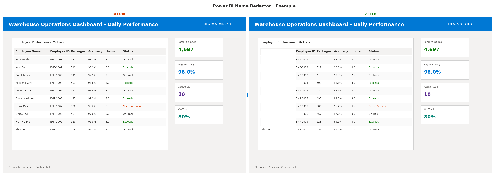

# Power BI Name Redactor

A lightweight Python tool to automatically redact sensitive information (names, PII) from Power BI dashboard screenshots before displaying them on public screens or sharing them.



## Use Case

In warehouse and operations environments, it's common to display real-time dashboards on monitors or Zoom Rooms for team visibility. However, these dashboards often contain employee names or other sensitive information that shouldn't be publicly visible. This tool automates the tedious manual process of screenshotting, editing, and uploading cleaned versions.

**Before this tool:** 10+ minute manual process daily  
**After this tool:** ~1 minute automated workflow

## Features

- ✅ Simple coordinate-based redaction (white box overlay)
- ✅ Preserves dashboard layout and readability
- ✅ Fast daily workflow - just screenshot and run
- ✅ No cloud services or API dependencies
- ✅ Works on locked-down corporate Windows machines

## Prerequisites

- Python 3.7+ (installable via Microsoft Store on Windows)
- Pillow (PIL) library

## Installation

### 1. Install Python

**Windows (Microsoft Store - Recommended for corporate machines):**
- Open Microsoft Store
- Search for "Python 3.12" (or latest version)
- Click "Get" to install

**Alternative: Download from python.org**
- Visit https://www.python.org/downloads/
- Download and run installer
- ⚠️ **Important:** Check "Add Python to PATH" during installation

### 2. Clone This Repository

```bash
git clone https://github.com/yourusername/powerbi-name-redactor.git
cd powerbi-name-redactor
```

### 3. Install Dependencies

```bash
pip install -r requirements.txt
```

## Setup (One-Time Configuration)

### Step 1: Take a Test Screenshot

1. Open your Power BI dashboard
2. Take a screenshot (Windows: `Win + Shift + S` or Snipping Tool)
3. Save it as `dashboard.png` in the project folder

### Step 2: Find Redaction Coordinates

1. Open `dashboard.png` in Paint (or any image editor)
2. Hover over the name column to find pixel coordinates (shown in Paint's status bar)
3. Note four values:
   - **Left edge** of name column (x)
   - **Top** of name column (y) - below header
   - **Right edge** of name column (x)
   - **Bottom** of name column (y)

Example: If your name column spans from x=250 to x=420, and y=180 to y=950

### Step 3: Update the Script

Edit `clean_dashboard.py` and update line 18:

```python
name_column_coords = [250, 180, 420, 950]  # [left, top, right, bottom]
```

### Step 4: Test

```bash
python clean_dashboard.py
```

Check `dashboard_clean.png` - the white box should perfectly cover all names.

## Daily Usage

### Option 1: Command Line

```bash
python clean_dashboard.py
```

### Option 2: Double-Click (Windows)

Just double-click `clean.bat` - no command line needed!

### Complete Daily Workflow:

1. Screenshot your Power BI dashboard
2. Save as `dashboard.png` (overwrites previous)
3. Run `clean.bat` or `python clean_dashboard.py`
4. Upload the generated `dashboard_clean.png` to your display system

**Time: ~1 minute** (vs 10+ minutes manually editing)

## File Structure

```
powerbi-name-redactor/
├── clean_dashboard.py    # Main Python script
├── clean.bat             # Windows batch file for easy execution
├── requirements.txt      # Python dependencies
├── README.md            # This file
├── LICENSE              # MIT License
├── .gitignore           # Excludes screenshots from git
└── examples/            # Example screenshots (sanitized)
    ├── README.md
    ├── dashboard_example_before.png
    ├── dashboard_example_after.png
    └── dashboard_comparison.png
```

## Advanced Usage

### Multiple Redaction Areas

To redact multiple columns or areas, modify the script:

```python
# Redact multiple areas
areas_to_redact = [
    [250, 180, 420, 950],  # Name column
    [850, 180, 1020, 950], # Another sensitive column
]

for coords in areas_to_redact:
    draw.rectangle(coords, fill='white')
```

### Custom Redaction Color

Change the fill color to match your dashboard background:

```python
draw.rectangle(name_column_coords, fill='#F0F0F0')  # Light gray
```

### Blur Instead of Block

For a softer redaction, use blur:

```python
from PIL import ImageFilter

# Crop the name area
name_area = img.crop(name_column_coords)
# Blur it heavily
blurred = name_area.filter(ImageFilter.GaussianBlur(radius=20))
# Paste back
img.paste(blurred, (name_column_coords[0], name_column_coords[1]))
```

## Future Enhancements

- [ ] Full automation with Selenium (login to Power BI, screenshot, upload)
- [ ] OCR-based name detection (no manual coordinate configuration)
- [ ] Support for multiple dashboard layouts
- [ ] Direct upload to Yealink/Zoom Room devices
- [ ] GUI for coordinate selection
- [ ] Docker container for scheduled execution

## Contributing

Contributions welcome! If you have ideas for improvements or find bugs, please open an issue or submit a pull request.

## Use Cases

This tool is useful for:
- Warehouse operations dashboards
- Manufacturing floor displays
- Retail performance monitors
- Call center metrics screens
- Any public display showing employee-specific data

## Security Note

⚠️ **Never commit your actual dashboard screenshots to GitHub!** The `.gitignore` file is configured to exclude `dashboard.png` and `dashboard_clean.png` to prevent accidental exposure of sensitive data.

## License

MIT License - See LICENSE file for details

## Author

Built to solve a real operational problem: automating the daily task of sanitizing Power BI dashboards for public display in warehouse environments.

## Acknowledgments

- Built with Python and Pillow (PIL)
- Inspired by the need to save 9+ minutes every single day on repetitive manual tasks
